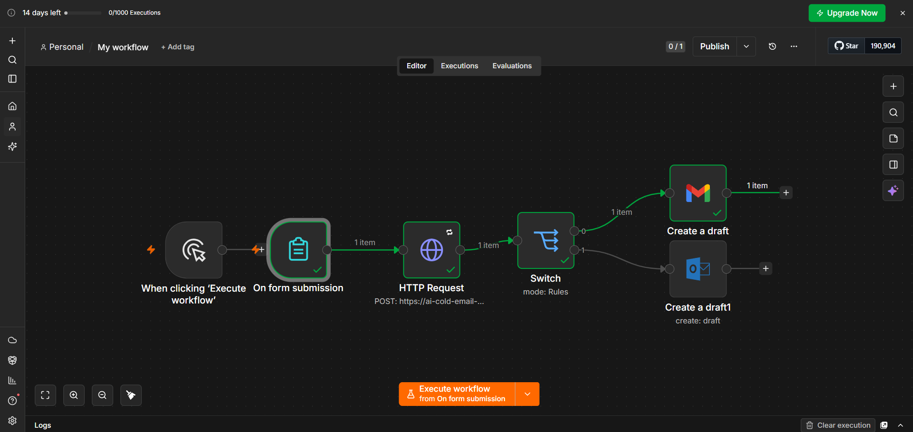
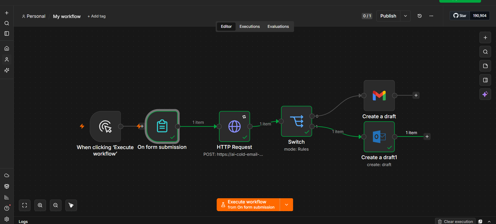
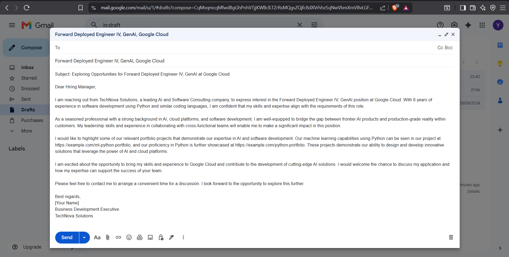
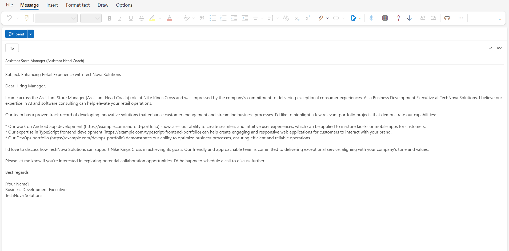

# AI-Powered Cold Email Automation with n8n

An intelligent automation workflow designed to streamline job outreach by generating personalized, context-aware email drafts using AI. 

### 🚀 Features
*   **Dynamic Personalization**: Leverages a custom AI agent to analyze job URLs and craft tailored outreach based on selected tone and template preferences.
*   **Conditional Routing**: Implements advanced branching logic to automatically route drafts to either **Gmail** or **Outlook** based on the user's provider selection.
*   **Data Security & Privacy**: Developed with a focus on the **Principle of Least Privilege**, utilizing manual OAuth2 app registration to restrict API permissions and minimize future risk.

### 🛠️ Tech Stack
*   **n8n**: Workflow orchestration and automation platform.
*   **Generative AI**: Specialized agent via HTTP request for professional email generation.
*   **OAuth2 Authentication**: Secure integrations with Microsoft Azure and Google Cloud Console.

### 📸 Project Previews

#### **Workflow Logic & Routing**
| Gmail Path (Active) | Outlook Path (Active) |
| :--- | :--- |
|  |  |

#### **Generated AI Drafts**
| Gmail Result | Outlook Result |
| :--- | :--- |
|  |  |

### 📂 How to Use
1.  **Import**: Download and import the `workflow.json` file into your n8n instance.
2.  **Configuration**: Connect your own credentials for Gmail and Outlook. 
3.  **Security**: For maximum security, it is recommended to use the "Manual Setup" method in the developer consoles to limit scope access.
4.  **Run**: Publish the workflow and use the built-in form trigger to begin generating personalized drafts instantly.

---
Created by Yashvi Vora
